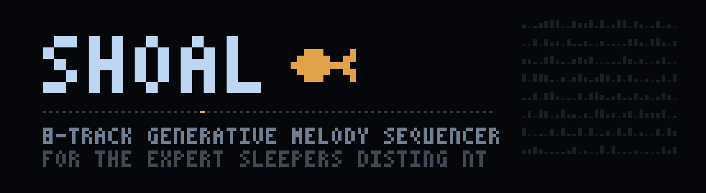

<p align="center">
  
</p>

<p align="center">
  <strong>Grown, not written</strong><br>
  Shoal plays melodies you didn't write, but that always sound like you meant them.
</p>

<p align="center">
  <a href="LICENSE"></a>
  
  
  
</p>

**Shoal** is an 8-track generative melody sequencer plug-in for the
[Expert Sleepers disting NT](https://www.expert-sleepers.co.uk/distingNT.html),
by [Ormer Modular](https://instagram.com/ormermodular), made in Guernsey.

Each track grows a looping melody from a **seed**, a number from 0 to 999.
The same seed always grows the same melody, so patterns repeat like
something you composed, and because the seed is an ordinary parameter your
presets recall your exact tunes. Every note is built from a global
**scale**, so nothing is ever out of key.

Patterns are never stored. Every note is worked out the moment it plays,
which means **nothing you do is destructive**. Turn up Note and Oct and the
melody strays further from home, more often and further each time; turn
them back to zero and the original line returns exactly as it was. You can
push a melody as far as you like and always find your way home.

And it moves on its own. **Evolve** lets a share of steps quietly re-roll
themselves on every pass, so at 5% a melody becomes a different melody over
ten minutes without your hands on it. **Breathe** rests whole passes.
The nine **directions** change how a pattern is walked rather than what it
contains, from plain reverse to tides, shuffles and pools. **Weight** pulls
notes towards consonance when things get too wild. Tracks can **follow** one
another for bass lines and counter-melodies that always agree. And when you
want something new entirely you **reseed**, and the shoal turns.

And it is all shareable: pass on your seed and your settings, and someone
on the other side of the world hears exactly what you heard, note for note.

📖 [**Manual**](docs/MANUAL.md) · 🐟 [Instagram](https://instagram.com/ormermodular)
· 🎣 [disting NT Plugin Gallery](https://nt-gallery.nosuch.dev/)

---

## Installing

Shoal uses disting NT plug-in API v13, introduced in firmware 1.15.0. Use
[firmware 1.15.0 or newer](https://www.expert-sleepers.co.uk/distingNTfirmwareupdates.html).

The easiest route is the [disting NT Plugin Gallery](https://nt-gallery.nosuch.dev/),
via the Plugin Manager in nt_helper. To install by hand instead:

1. Download `shoal-plugin.zip` from the latest
   [release](https://github.com/ormermodular/shoal/releases).
2. Unzip it at the root of the disting NT SD card.
3. Restart the module or remount the card so the plug-in folder is
   scanned, then add **Shoal**.

The archive installs `shoal.o` at `/programs/plug-ins/ormermodular/shoal.o`. No compiler
or development toolchain is required.

On macOS, if the card already has a `programs` folder, Finder may create a
second folder called `programs 2` rather than merging. If that happens, move
`shoal.o` into the existing `programs/plug-ins` folder and delete the
leftover.

The algorithm appears in the list as **Shoal** (guid `Shol`).

## Quick start

1. **Add the algorithm.** It is already ticking: Clock source defaults to
   Internal at 120 BPM. To sync to your rack instead, set Clock source to
   External and patch a clock into **Input 1**, and optionally a reset into
   **Input 2**.
2. **Give Track 1 outputs.** Every output starts as **None**, so on the
   *Routing 1* page set **Gate out** to Output 2 and **Pitch out** to
   Output 1, then patch to an envelope and an oscillator. Set **Scale** and
   **Root note** on the Global page.
3. **Reseed until you like it.** Tap the right encoder. Each tap grows a new
   melody, landing at the top of the next loop.
4. **Add a bass line.** On Track 2 set **Sample source** to Track 1,
   **Octave** to -1 or -2, **Rate** to /2 or /4, and thin it out with
   **Chance**.

The [manual](docs/MANUAL.md) covers the rest, and there is rather a lot of
rest.

## Features

- **8 tracks of CV** - each with its own 1V/oct pitch output (0V = C3) and
  5V gate output, routable to any physical output or aux bus. **All outputs
  default to None**, so a track touches no bus until you assign it and you
  build the shoal one deliberate voice at a time
- **Per track** - length 1 to 64, clock rate /64 to x64 including the odd
  ratios (3, 5, 6 and 7, both ways), nine playback directions (Forwards,
  Reverse, Pendulum, Random, Drunk, Pong, Tide, Shuffle, Pools), Chance,
  bipolar Note and Oct variation amounts, gate length, tie chance, slop,
  octave offset, transpose in scale degrees, mute, seed
- **The slow arts** - per-track **Evolve** (steps quietly re-roll themselves
  each pass) and **Breathe** (whole passes rest), plus global **Freeze**
  (hold the shoal as a chord) and **Weight** (gravity towards the root,
  third and fifth)
- **Tracks that follow** - point one track's Sample source at another and it
  grows the same material through its own settings, at its own rate and
  length. Reseed the source and the follower changes with it
- **Global scale** - chromatic, major, natural and harmonic minor, Dorian,
  Phrygian, Lydian, Mixolydian, major and minor pentatonic, blues,
  Hirajoshi, In-Sen, with a root note. Notes are built from scale degrees
  rather than quantised afterwards, so nothing is ever out of key
- **Clocking** - internal clock with BPM (the default, so a fresh Shoal runs
  at 120 out of the box) or an external CV clock, with a reset input that
  realigns every track to step 1
- **Clock out** - Shoal's master clock as 5V pulses on any bus, in either
  clock mode, so other algorithms and external gear can ride its grid
- **Quantised reseeds** - a reseed arms and lands when the track wraps to
  step 1, so new patterns always enter on the grid. Per track and global
- **Everything is CV and MIDI mappable** - all 173 parameters, through the
  module's own mapping system. Sequence the Seed for melody switching,
  breathe Freeze with a slow LFO, CV the Transpose for chord progressions
- **The shoal screensaver** - leave the controls alone and the display
  becomes open water: eight fish, one per track, each darting when its track
  sounds a note. An ambient view of your patch, and kind to the OLED

### The performance controls

Buttons 1 to 4 are left to the module's own UI. Shoal claims the pots and
encoders:

| Control | Gesture | Action |
|---|---|---|
| Pot L | turn / push | Chance · push toggles home (100%) and your dialled value |
| Pot C | turn / push | Note ±100% (bipolar) · push toggles home (0) and dialled |
| Pot R | turn / push | Oct ±100% (bipolar) · push toggles home (0) and dialled |
| Enc L | turn | select track |
| Enc L | tap / hold | mute · solo |
| Enc L | push and turn | Length |
| Enc R | turn | Rate, /64 to x64 |
| Enc R | tap / hold | reseed track · reseed all |

Pots use soft takeover throughout. The display shows all eight tracks with
their patterns, play positions, rates, follow links and mute or solo state,
alongside the selected track's detail panel and the live pot assignments.

## Parameter pages

- **Global** - clock source, BPM, run, freeze, scale, root note, weight,
  screensaver, clock and reset inputs, clock out, reseed all
- **Track 1 to 8** - the per-track controls above
- **Routing 1 to 8** - gate and pitch output busses with add or replace
  modes, gate listed first to match the other NT sequencers

Every one is a standard NT parameter, so all of them are CV and MIDI
mappable and all of them are saved in presets. Changing a track's **Seed**
by any means, including a CV mapping, arms a reseed that lands at that
track's next loop start.

## Building from source

Prebuilt releases are above, so this is only needed if you want to change
something. You will need the
[GNU Arm Embedded Toolchain](https://developer.arm.com/downloads/-/arm-gnu-toolchain-downloads)
(`arm-none-eabi-c++`) on your PATH.

```sh
make api    # clones the distingNT_API headers, once
make        # builds plugins/shoal.o
```

`make check` runs a quick syntax check with the host compiler if you do not
have the ARM toolchain installed.

## Repository layout

- `src/shoal.cpp` - the plug-in, a single source file
- `docs/MANUAL.md` - the user manual
- `Makefile` - cross-compiles for the Cortex-M7 with `arm-none-eabi-c++`

## Thanks

Shoal was shaped by a private beta with a small and generous group of
testers, whose ideas ended up in the plug-in: the odd clock ratios, the
gate-first routing order and a good deal more. Thanks also to Expert
Sleepers for the module and the plug-in API, and to Thorinside for the
Plugin Gallery and nt_helper.

## Licence

MIT. See [LICENSE](LICENSE).
